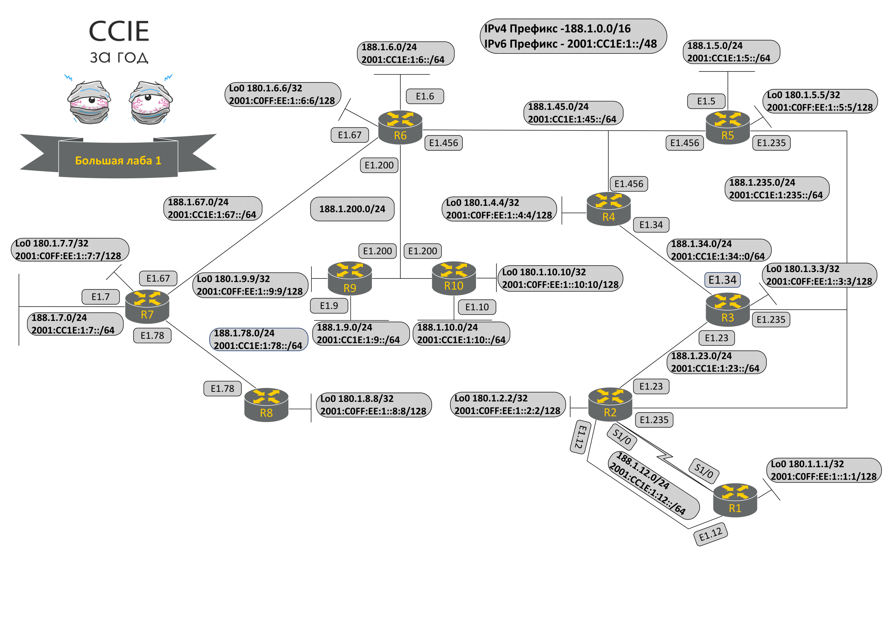

# Большая лабораторная работа.

### **Изменения топологии:**

* Диагональные линки e3/2, e3/3 между коммутаторами выключены.
* DMVPN underlay линки \(e0/1.144\) выключены.
* Линки между R8, R9 и R10 \(VLAN89, VLAN108, сериал линки s1/0-s1/1\) выключены.
* На R6, R9 и R10 добавлен интерфейс в VLAN200.

### Топология большой лабораторной работы:





Скачать [файлы для импорта лабораторной работы в UNL](https://drive.google.com/open?id=0ByVf6yfX4EBfeHNZTDBVSjBZOVk). Вам нужно будет импортировать zip файл в свою виртуальную машину.

Или [загрузить начальную конфигурацию](https://drive.google.com/file/d/0B3uwAH0p4u2NUUIyc3dCQ3l1ekk/view?usp=sharing).

Всё, что относится к лабораторной на [Google Disk](https://drive.google.com/folderview?id=0B3uwAH0p4u2NR2ppOEh4MWFwbFU&usp=sharing).

**Советы:**

* При выполнении заданий если вы заметили необычный конфиг, запишите его себе — вполне возможно, что это поможет вам решить последующие задания.
* Не забывайте включать обратно интерфейсы, если вы их выключали для теста.
* Проверки, указанные после задания, не гарантируют, что вы выполнили задание на 100% правильно.
* Будьте внимательны! Из-за неправильно выполненного подзадания вы можете получить 0 баллов за всё задание.

**Правила \(UPD: 05.04.2016\):**

* Нельзя добавлять дополнительные интерфейсы/IP адреса, если в задании это явно не упомянуто.
* Нельзя использовать PBR.
* Нельзя использовать динамическую маршрутизацию.
* Нельзя использовать Multilink и сериал интерфейсы на R9, R10.
* Нельзя использовать менеджмент Vlan 1 \(10.0.0.0/24\).
* Лабораторная работа включает в себя смешанные задания по configuration и troubleshooting.
* Большинство устройств преднастроено \(но не всегда верно\).
* При решении заданий проверяйте есть ли уже конфигурация, которую можно использовать.
* Не рекомендуется удалять любой существующий конфиг — удаляйте только в случае, если других решений нет.
* В своих решения вы должны быть как можно более специфичны:

**Пример с access-list:**

```text
ip access-list extended TEST
 5 deny ip 10.0.0.0 0.255.255.255 any
 10 permit ip any any
interface e0/0
 ip access-group TEST in
```

_Проблема: Специфичный HTTP траффик \(src IP: 10.10.10.10, dst IP: 2.2.2.2, port 80\) дропается, когда приходит на e0/0._

Неправильные решения:  
1.

```text
inteface e0/0
no ip access-group TEST in
```

2.

```text
ip access-list extended TEST
no 5
```

Нейтральное решение \(правильность оценивается на усмотрение эксперта\):

```text
ip access-list extended TEST
 4 permit ip 10.0.0.0 0.255.255.255 any
```

Правильное решение:

```text
ip access-list extended TEST
4 permit tcp host 10.10.10.10 host 2.2.2.2 eq 80
```

**Удачи! Она вам пригодится!**

#### 

#### Задание лабораторной

**1. \(2 баллов\)**

На всех коммутаторах VTP должен быть полностью выключен.

**2. \(4 баллов\)**

R2 должен пинговать IP адрес R1 Loopback0 \(180.1.1.1\) и путь до него должен проходить через s1/0.  
Если интерфейс s1/0 в состоянии down, то пинг должен идти через e0/1.12  
Нельзя изменять существующие и добавлять новые статические маршруты, использование PBR также запрещено.

**Проверка:**

```text
R2#ping 180.1.1.1
Type escape sequence to abort.
Sending 5, 100-byte ICMP Echos to 180.1.1.1, timeout is 2 seconds:
!!!!!
Success rate is 100 percent (5/5), round-trip min/avg/max = 5/7/9 ms
R2#show ip cef | i 180.1.1.1
180.1.1.1/32 attached Serial1/0

R2#conf t
R2(config)#int s1/0
R2(config-if)#shut
R2(config-if)#end
R2#ping 180.1.1.1
Type escape sequence to abort.
Sending 5, 100-byte ICMP Echos to 180.1.1.1, timeout is 2 seconds:
!!!!!
Success rate is 100 percent (5/5), round-trip min/avg/max = 1/1/1 ms
R2#show ip cef | i 180.1.1.1
180.1.1.1/32 188.1.12.1 Ethernet0/1.12
```

**3. \(8 баллов\)**

Настройте SSH доступ на R4 согласно следующим требованиям:  
1\) Доменное имя: linkmeup.ru  
2\) Размер RSA ключа должен быть 2048 бит  
3\) Из протоколов удаленного доступа только SSH должен быть разрешён  
4\) Использовать локальную базу пользователей для аутентификации \(пользователь cisco/cisco преднастроен\)  
5\) SSH тайм-аут до успешной аутентификации должен быть в два раза меньше значения по умолчанию.  
6\) Версия SSH: 2  
7\) После двух неудачных попыток логина в течение 60 секунд, маршрутизатор должен запрещать последующие  
попытки входа на vty на 30 секунд.  
В результате R6 должен успешно подключиться к R4 Loopback0 по SSH.

**Проверка:**

```text
R6#ssh -l cisco 180.1.4.4
Password: cisco
R4>
```

**4. \(6 баллов\)**

Настройте Telnet доступ на R8 согласно следующим требованиям:  
1\) При подключении устройство не должно запрашивать пароль  
2\) Пользователь должен сразу попадать в privileged-level EXEC  
3\) Из протоколов удаленного доступа только Telnet должен быть разрешён  
4\) Устройство также должно слушать на 3008 порту для входящих telnet сессий.  
5\) При вводе неправильной команды устройство не должно пробовать подключаться через telnet,  
пытаясь разрешить DNS имя неправильной команды. При этом устройство всё равно может разрешать DNS имена \(например, если используется ping\). Этот подпункт должен быть выполнен для консоли и виртуальных линий \(vty\).  
После настройки убедитесь, что можно подключиться по Telnet с R7 на R8 Loopback0

**Проверка:**

```text
R7#telnet 180.1.8.8 3008
Trying 180.1.8.8, 3008 ... Open
R8# q

[Connection to 180.1.8.8 closed by foreign host]
R7#telnet 180.1.8.8
Trying 180.1.8.8 ... Open

R8#
R8#wrong
^
% Invalid input detected at '^' marker

R8#ping linkmeup.ru repeat 1
Translating "linkmeup.ru"...domain server (255.255.255.255)

Translating "linkmeup.ru"...domain server (255.255.255.255)
^
% Invalid input detected at '^' marker.
```

**5. \(8 баллов\)**

R5 должен подключаться к R1 Loopback0 по Telnet.  
Для этого задания изменения на R1 запрещены.  
Заметка: пароль cisco.

**Проверка:**

```text
R5#telnet 180.1.1.1
Trying 180.1.1.1 ... Open
User Access Verification

Password: cisco
R1>
```

**6. \(8 баллов\)**

Между R6 и R7 должна быть поднята PPPoE сессия. R6 — сервер, R7 — клиент.

Настройте клиент согласно следующим требованиям:  
1\) Номер интерфейса должен быть 1.  
2\) Номер dialer pool должен равняться количеству возможных режимов в VTPv2  
3\) R7 должен получить IP адрес от R6 из подсети 188.1.76.0/24  
\* Заметка: это не означает, что маска должна быть /24.  
4\) Сервер должен аутентифицировать клиента \(но не наоборот\) с помощью CHAP, пароль — «CCIE» \(без кавычек\)  
5\) R7 должен установить дефолтный маршрут, указывающий на PPPoE сервер.  
\* Заметка: для этого подзадания нельзя использовать команду «ip route»

Подсказка: key chain может помочь.

**Проверка подзадания 5:**

```text
R7#show ip cef 0.0.0.0/0
0.0.0.0/0
nexthop 188.1.76.6 Dialer1
```

**7. \(6 баллов\)**

R9 должен пинговать R10 IP адрес интерфейса e0/1.200.  
Изменения на всех свитчах запрещены.  
Использование статических маршрутов/PBR запрещено.

**Проверка:**

```text
R9#ping 188.1.200.10
Type escape sequence to abort.
Sending 5, 100-byte ICMP Echos to 188.1.200.10, timeout is 2 seconds:
!!!!!
Success rate is 100 percent (5/5), round-trip min/avg/max = 1/1/2 ms
```

**8. \(6 баллов\)**

На R3 настройте плавающий статический дефолтный маршрут:  
— Основной маршрут должен идти через R4 \(188.1.34.4\).  
— Запасной маршрут должен идти через R5 \(188.1.235.5\) и вступать в силу только, если line protocol интерфейса e0/1.34 на R3 в down.  
\* Заметка: для этого задания нельзя использовать track  
Для теста используйте R6 Loopback0 \(180.1.6.6\)

**Проверка:**

```text
R3#trace 180.1.6.6 so lo0 nu
Type escape sequence to abort.
Tracing the route to 180.1.6.6
VRF info: (vrf in name/id, vrf out name/id)
1 188.1.34.4 2 msec 1 msec 2 msec
2 188.1.45.6 2 msec 2 msec 2 msec
R3#conf t
R3(config)#int e0/1.34
R3(config-subif)#shut
R3(config-subif)#end
R3#trace 180.1.6.6 so lo0 nu
Type escape sequence to abort.
Tracing the route to 180.1.6.6
VRF info: (vrf in name/id, vrf out name/id)
1 188.1.235.5 2 msec 0 msec 0 msec
2 188.1.45.6 2 msec 1 msec 1 msec
```

**9. \(12 баллов\)**

Все роутеры должны пинговать Loopback0 друг друга, если source IP — Loopback0.

#### Проверка лабораторной

В большой лабораторной проверяется не только разница с ответом в конфигурации.  
Кроме того, ваши конфиги будут загружены экспертом на оборудование и проверка будет выполняться командами show/ping и тд.  
Поэтому то, что показано в проверке к заданиям лабы \(вывод команд show/ping/…\), должно у Вас выглядеть точно так же.  
Обязательно, после каждого задания, выполняйте проверочные команды, которые указаны в лабораторной.

Вам не нужно выкладывать вывод команд show в ответе. Для больших лаб, мы это проверяем сами. Нужно выложить только конфигурацию.


_Если у вас возникли вопросы по заданию, пройдите по_ [_ссылке_ ](http://ccie.linkmeup.ru/2016/05/02/pervaya-bolshaya-laboratornaya-rabota/)_вы попадете в раздел комментариев к заданию на сайте_ [_ccie.linkmeup.ru_](http://ccie.linkmeup.ru/)_. Возможно участники проекта уже ответили на них._



